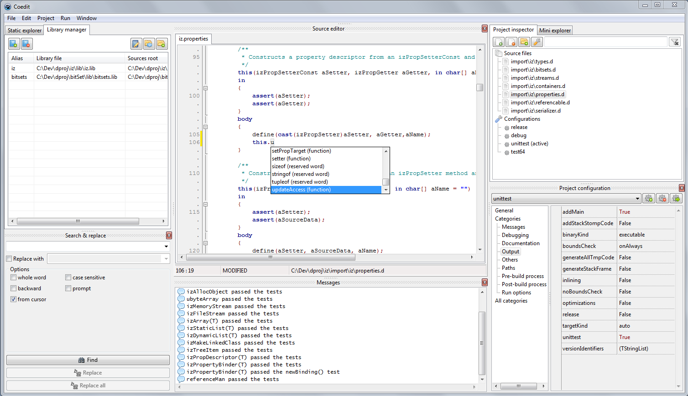
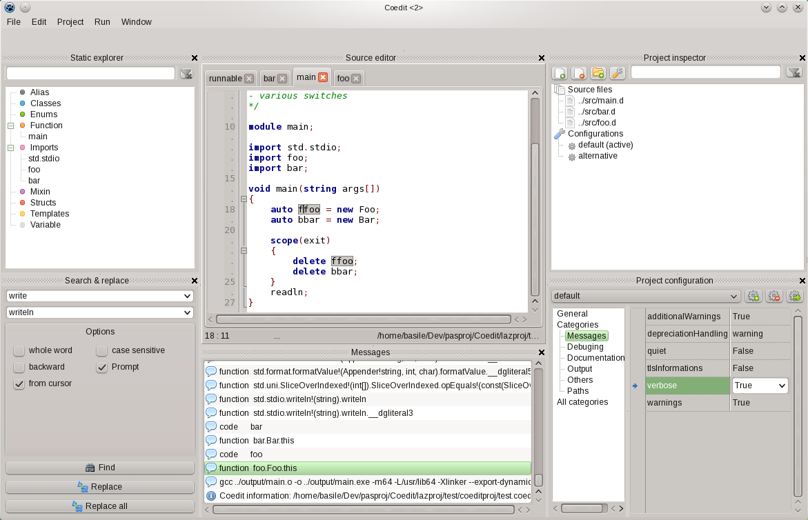

Coedit
======

Coedit is a simple IDE for the [D2](http://dlang.org) lang. (**Co** mpile & **Edit**).

Current features
----------------
- multi platform (Win/Linux).
- projects.
- multiple project configurations (set of switches and options).
- compile, run directly from the UI.
- instant run (without saving, script-like).
- synchronized edition in a block.
- D syntax highlighter, folding, identifier markup.
- current module member list.
- search and replace.

Planed in version 1
-------------------
- project configurations templates (release, debug, etc.).
- basic auto completion (brackets, key-words, ...).
- console input handling.
- static library explorer (using JSON infos).

Project information
-------------------
- state: alpha 4.
- license: MIT.
- programmed in Pascal with [Lazarus](http://www.lazarus.freepascal.org).
- based on *dmd* (*gdc* or *lmd* characteristics are not handled).
- no other third part dependencies (so far...but using *dscanner* and/or *dcd* is envisaged.)

Setup & test
------------
Coedit must be build from its sources.
The complete procedure is described in the first section of the [wiki](https://github.com/BBasile/Coedit/wiki)

Preview
-------
Windows version:

Linux version:
